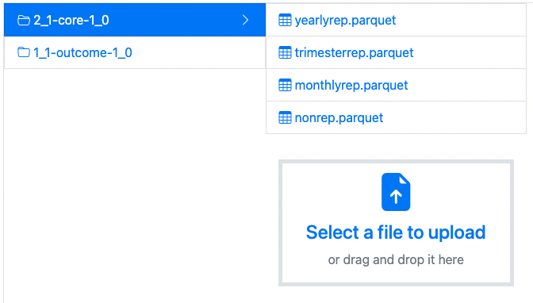
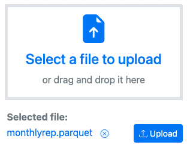
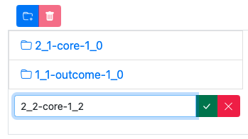

# Armadillo User Interface
Since Armadillo version 3, a lot has changed compared to its previous version. One of these changes is the addition of
a user interface, or UI for short. This UI will be replacing the MinIO file storage and the permission management page,
as well as adding several new features that will be extended upon.

## Table of contents
1. [Login](#login)
   1. [Superuser](#superuser)
2. [Projects](#projects)
   1. [Editing projects](#edit-projects)
   2. [Adding projects](#add-projects)
3. [Project explorer](#project-explorer)
   1. [Resources](#resources)
4. [Users](#users)
   1. [Editing users](#edit-users)
   2. [Adding users](#add-users)
5. [Profiles](#profiles)

## Login <a name="login"></a>


To login to the UI, select the Institute account button and login using the institute login screen you will be 
redirected to.
### Superuser <a name="superuser"></a>
You need to have admin or superuser permissions. This means you need to be granted permission in 
order to be able to use the UI. If you don't have correct permissions, you will receive the following error:


If you receive this error, contact someone in your institute that is able to login without an error, or if you don't
have anyone available, molgenis-support@umcg.nl.
Fixing the issue can be done by searching for the correct user in the `Users` tab of the UI, and then checking the
admin checkbox for that user:


## Projects <a name="projects"></a>
Once you're logged in, you will be redirected to the projects page. In this page you can add and edit projects. You
can add users to projects and navigate to the "project-editor"-view. You can search through the projects using
the search bar on the top right.


### Editing projects <a name="edit-projects"></a>
To edit your project, click on the edit button in front of the project you want to edit button: 
. The row will be opened in edit mode:


Edit mode can be recognized by its blue background color and you have the option to add new users to your project by 
clicking on the + button  of the users column. Then you can either
select an existing user from the dropdown, or add the email address of a new user. 


In case of adding a user in this screen, a warning will be shown to prevent users with 
typing errors are added to your system. Keep in mind that, just as the warning message suggests,
you, the user will only be added if you save the row you are editing in the projects.


It is not possible to edit the name of your project; this was done 
intentionally because we cannot ensure tables, resources, users, and permissions are transferred to the new project 
name succesfully. 

Click on the checkmark  to save the edited row and the X 
 to cancel. Be careful, if you do so, your changes will be lost. 

### Adding projects <a name="add-projects"></a>
To add a new project, click on the + button  on top of the table. If 
you click this button, on top of your table, an empty row will be opened in edit mode. 


Click on the checkmark  to save the edited row and the X
 to cancel. Be careful, if you do so, your changes will be lost. 

## Project explorer <a name="project-explorer"></a>
If you click on the icon  next to the project name, you will be taken to
what we call the project editor. In this screen you can upload and preview data in projects. To get back to your 
projects page, press the back button . 


If you click on a folder, it will open.



Here you can upload files into that folder, or click on the tables to preview their contents.


To upload files, either drag a file from your file browser to the file upload area, or click the area and select the
file.



After selecting the file, click on upload to upload it. 

It is also possible to create new folders. To do so, click the "add folder" button 
 , just below the project name. An input 
dialog will be presented:



Fill in the name you like to use and click on the checkmark  button 
. Please keep in mind that, just as the success message suggests,
the folder will only be saved if you put data in it. Select the new folder to select files to upload.

### Resources <a name="resources"></a>
In theory, all files can be uploaded into the projects. The only filetypes that allow for a preview are `.parquet`
files. Other files that can be uploaded, are resources. Resource filetypes usually are `.rda` files or `.Rdata` files.
For researchers to be able to use these resources, first an `.rds` file must be generated. How to create those files, is
described [here](https://molgenis.github.io/molgenis-r-armadillo/articles/create_resources.html).
The URL of your resources is build up as follows:

```
{your url}/storage/projects/{project name}/objects/{name of the folder}%2F{the resource file}
```
Here's an example, with some given parameters:
```
url = "https://armadillo3.demo.molgenis.net"
project = "omics"
folder = "ewas"
file = "gse66351_1.rda"

Result: 
https://armadillo3.demo.molgenis.net/storage/projects/omics/objects/ewas%2Fgse66351_1.rda
```

## Users <a name="users"></a>
The users page works just as the projects page. You can search users by entering (part of) the email address or name of
the user into the search box:


### Editing users <a name="edit-users"></a>
Users can just as projects, be edited, except for their email addresses. This is not only because we cannot ensure all
projects are transferred as expected, but also because when an email address of a user changes, possibly that user is
not working for the same institution anymore and therefore is possibly not allowed to keep their previous project 
permissions. 


In edit mode, the row will turn blue. Projects can be added by clicking on the + icon 
 in the projects column.


You can add a non-existing project by simply typing it and clicking the checkmark button 
. You will be prompted a warning message, asking you to confirm to 
add a new project, once the user is saved. This is to make sure projects with typing errors are not added by mistake.
Alternatively, you can select an existing project by typing to search through the presented list, or by scrolling to it
and then selecting the desired project. 

### Adding users <a name="add-users"></a>
By clicking on the plus button  on top op the table, a new user can
be added. The row with the new user will turn blue to show the user screen is in edit mode. 


Users can be added before they have logged in previously. These users can be added to projects and thereby granting them
permission to retrieve data uploaded into those projects upon their login. Although users have to be admin or superuser
to be able to login to the UI. Researchers should not be set to be admin. 

## Profiles <a name="profiles"></a>


Since the release of Armadillo 3.0.0, it is possible to create and manage profiles in the user interface, rather than 
asking system administrators to manage these profiles. You can start 
 and stop  profiles. 
When you start a profile for the first time, it will take a bit longer to load because the profile needs to be 
downloaded and installed before it can be started. 


If you switch to the other screens while either starting or stopping a profile, the profiles page will not
show the loading information anymore. It is however still loading, and when it's done, if you reload the page, you will
see that your profile started or stopped successfully.

Just like in the other screens, you can add profiles with the add-button 
. 


By default, some fields will be set. Please update them to install the correct profile. Possible images can be found on
[dockerhub](https://hub.docker.com/search?q=datashield%2Farmadillo-rserver). Although the default `port` setting should
find an available port, please keep in mind that the port has to be unique, otherwise you cannot start your profile and
will receive and error message. Packages can be whitelisted by adding them to the `package whitelist` column so 
researchers can use them. Additionally, it's possible to blacklist certain functions in the `blacklist function` column.
Editing a row is basically the same as adding one. 