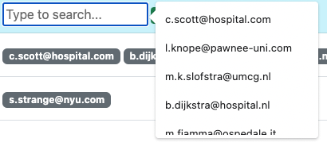

# Armadillo User Interface
Since Armadillo version 3, a lot has changed compared to its previous version. One of these changes is the addition of
a user interface, or UI for short. This UI will be replacing the MinIO file storage and the permission management page,
as well as adding several new features that will be extended upon.

## Headers

## Login

To login to the UI, select the Institute account button and login using the institute login screen you will be 
redirected to.
### Superuser
You need to have admin or superuser permissions. This means you need to be granted permission in 
order to be able to use the UI. If you don't have correct permissions, you will receive the following error:

If you receive this error, contact someone in your institute that is able to login without an error, or if you don't
have anyone available, molgenis-support@umcg.nl.
Fixing the issue can be done by searching for the correct user in the `Users` tab of the UI, and then checking the
admin checkbox for that user:

## Projects
Once you're logged in, you will be redirected to the projects page. In this page you can add and edit projects. You
can add users to projects and navigate to the "project-editor"-view. You can search through the projects using
the search bar on the top right.

### Edit
To edit your project, click on the edit button in front of the project you want to edit button: 
. The row will be opened in edit mode:

Edit mode can be recognized by its blue background color and you have the option to add new users to your project by 
clicking on the + button of the users column. Then you can either select an existing user from the dropdown, or add the
email address of a new user. 

In case of adding a user in this screen, a warning will be shown to prevent users with 
typing errors are added to your system. Keep in mind that, just as the warning message suggests,
you, the user will only be added if you save the row you are editing in the projects.

It is not possible to edit the name of your project; this was done 
intentionally because we cannot ensure tables, resources, users, and permissions are transferred to the new project 
name succesfully. 

Click on the checkmark  to save the edited row and the X 
 to cancel. Be careful, if you do so, your changes will be lost. 

### Add
To add a new project, click on the + button  on top of the table. If 
you click this button, on top of your table, an empty row will be opened in edit mode. 

Click on the checkmark  to save the edited row and the X
 to cancel. Be careful, if you do so, your changes will be lost. 

### Project editor
If you click on the icon  next to the project name, you will be taken to
what we call the project editor. In this screen you can upload and preview data in projects. To get back to your 
projects page, press the back button . 

If you click on a folder, it will open.

Here you can upload files into that folder, or click on the tables to preview their contents.

